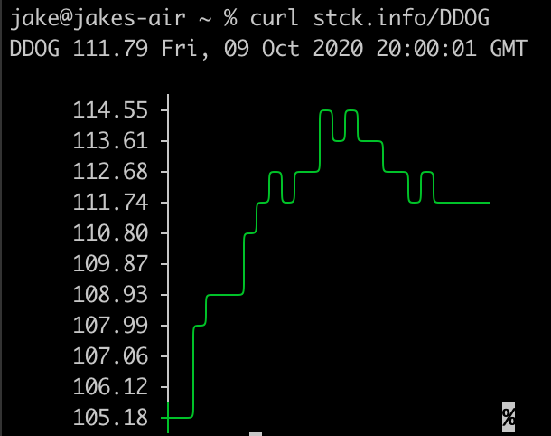

# stck.info

A simple wrapper for the yahoo finance api to enable retireval of stock quotes from the terminal.

#### Planned Features
* Additional filters
* Charting

#### Installing golang client
As needed replace `~/go` with your configured `GOPATH`
* Follow install and setup for [golang](https://golang.org/doc/install)
* `mv go-client ~/go/src/stock-client`
* `cd ~/go/src/stock-client`
* `go build -o stock`
* `go install`
* `stock <ticker>`
